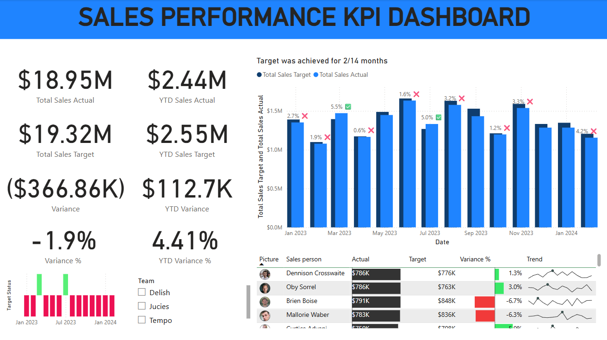
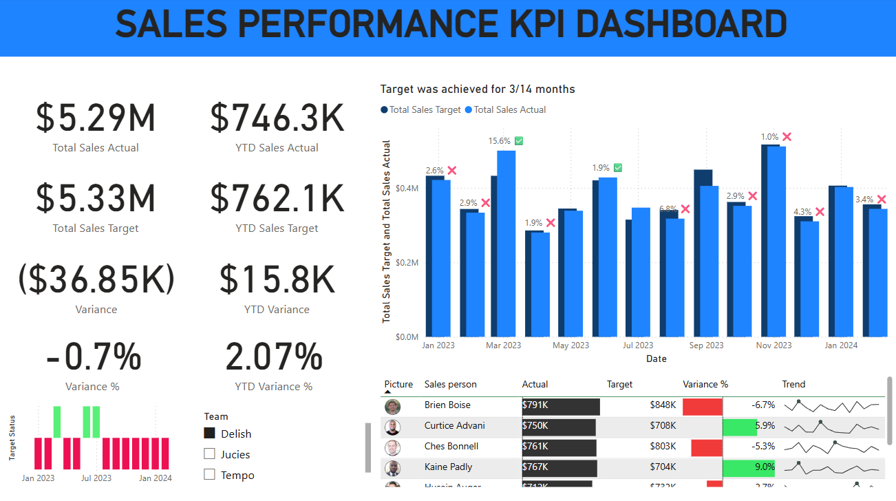

# 📊 Sales Performance KPI Dashboard

This project is a **Sales KPI Dashboard** built in **Power BI**, designed to monitor performance against sales targets using dynamic visuals and calculated metrics. The dashboard presents both high-level and detailed views of key indicators such as actual sales, targets, variances, and YTD performance, along with employee-wise insights.

## 🚀 Features

- **Key Metrics Tracked**:
  - Total Sales Actual
  - Total Sales Target
  - Variance & Variance %
  - YTD Sales Actual
  - YTD Sales Target
  - YTD Variance & YTD Variance %

- **Visualizations**:
  - Clustered Column Chart for Actual vs Target
  - Team Slicer: Allows filtering the dashboard by one of four sales teams to view team-specific performance
  - Employee-wise performance table with:
    - Actual
    - Target
    - Variance %
    - Trendline (Sparkline)

## 🛠️ Data Sources & Preparation

The data model included the following tables:

- `Actual`
- `Targets`
- `dimPeople`
- `Calendar`

**Steps Taken**:

- **Power Query**: Cleaned and formatted the data appropriately.
- **Model View**: Created relationships between tables.
- **DAX Modeling**: Created calculated measures for KPIs.
- **Dashboarding**: Designed visuals and formatted components for readability and insight.
- **Slicer Setup**: Added a slicer to filter by team and view team-specific performance metrics.

## 📎 Tools Used

- Power BI  
- DAX  
- Power Query (M)  
- Data Modeling

## 📌 Purpose

This dashboard project was built to:

- Practice KPI tracking and DAX calculations  
- Demonstrate Power BI dashboarding and data modeling skills  
- Showcase an example of a business-focused reporting tool for performance analysis  
- Enable team-level insights using interactive filtering

## 🧮 DAX Measures Used

- Target Status = IF([Variance] > 0, 1, -1)

- Total Sales Actual = SUM(Actual[Sales])

- Total Sales Target = SUM(Targets[Sales])

- Variance = [Total Sales Actual] - [Total Sales Target]

- Variance % = DIVIDE([Variance], [Total Sales Target])

- Variance Label = 
     VAR up = "✅"
     VAR down = "❌"
     VAR formatted_var_pct = FORMAT(ABS([Variance %]), "0.0%")
     RETURN formatted_var_pct & " " & IF([Variance %] > 0, up, down)

- YTD Sales Actual = CALCULATE([Total Sales Actual], DATESYTD('Calendar'[Date]))

- YTD Sales Target = CALCULATE([Total Sales Target], DATESYTD('Calendar'[Date]))

- YTD Variance = [YTD Sales Target] - [YTD Sales Actual]

- YTD Variance % = DIVIDE([YTD Variance], [YTD Sales Target])

## 📷 Screenshots

  

